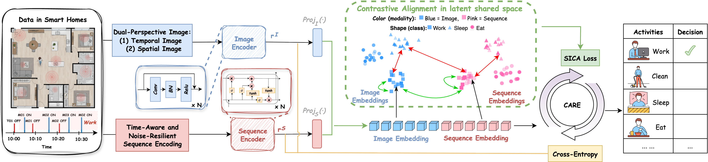

# CARE

This is the offical repo of CARE: Contrastive Alignment for ADL Recognition from Event-Triggered Sensor Streams, an end-to-end framework that jointly optimizes representation learning via Sequence-Image Contrastive Alignment (SICA) and classification via cross-entropy, ensuring both cross-representation alignment and task-specific discriminability.The paper is published on Percom 2026. We will provide the paper link once we have the camera ready version.
## Setup
Our code is working on Python 3.9. users can run the following code to setup.
```bash
conda env create -f environment.yaml
conda activate CARE
```
## Data Download
Data can be either downloaded from CASAS(https://casas.wsu.edu/) or our google drive (https://drive.google.com/drive/folders/1eWQihhGHWFVzopOJw_xP7Yxl8YURE6l1?usp=sharing). We trained and tested on Milan, Cairo and Kyoto7. 

All the datasets files are provided by CASAS(https://casas.wsu.edu/). If users used the dataset, please cite their paper or other references from their website:
```
@article{cook2012casas,
  title={CASAS: A smart home in a box},
  author={Cook, Diane J and Crandall, Aaron S and Thomas, Brian L and Krishnan, Narayanan C},
  journal={Computer},
  volume={46},
  number={7},
  pages={62--69},
  year={2012},
  publisher={IEEE}
}
```

## Data Preprocessing
Before the model training, please run the following code to process usersr raw data.

If users want to use our default setting, users can directly run:
```bash
bash dataset_gen.sh
```
If users want to customize the padding length, dataset, frequency filtering threshold or temporal binning, users can run:
```python
python DataGeneration.py --datasets milan --threshold 0.01 --maxlen 1500 --bin 1
python DataGeneration.py --datasets cairo --threshold 0.01 --maxlen 1500 --bin 1
python DataGeneration.py --datasets kyoto7 --threshold 0.1 --maxlen 1500 --bin 1
```

## Model Training and Testing
Run the following code can quickly get the results:
If users use our default setting to process the data, then users can just run:
```bash
bash run.sh
```
If users customize usersr setting, please make sure the following setting are consistent:
```bash
CUDA_VISIBLE_DEVICES=device_id python ContrastLearning.py --dataset $dataset --BiLSTM $Bi --seed $seed --filter_threshold $filter_threshold --weight $weight --maxlen 1500 --K 5 --epoch 60 --batchsize 64 --trainratio 0.7
```

All the results will be stored in the local logs. 
We also provide the "--ckpt" argument if users want to skip the training process. After users finished the training or download our pretrained model from google drive, they can add the local path of checkpoint file to this argument. And then the program will perform the testing directly.
## Model Tuning
If users want to determine some hyperparameters by K-fold cross validation, please remove the `--full-training` option in the training command. The default fold number K is 5 and it can be set by `--K`.
